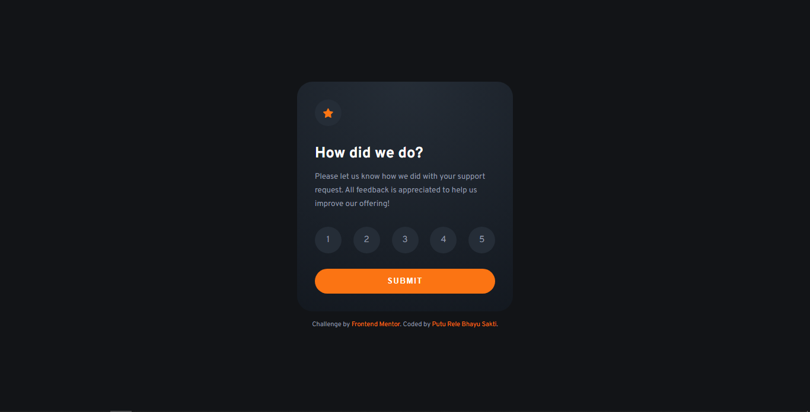
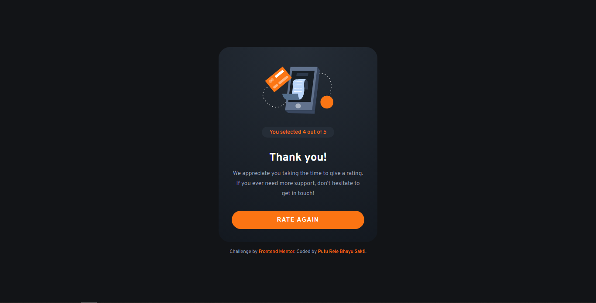
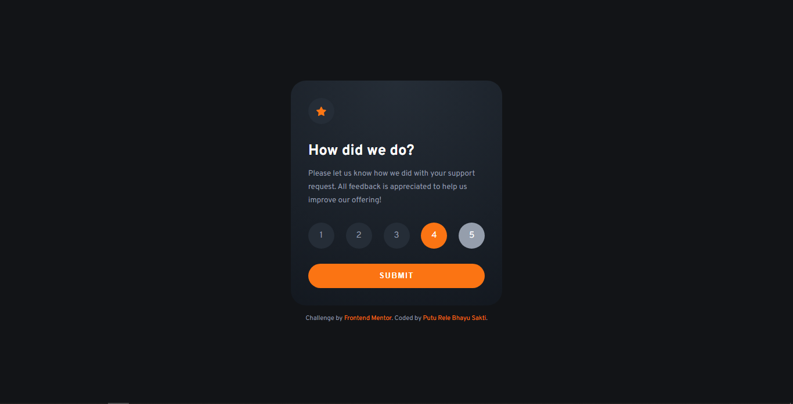
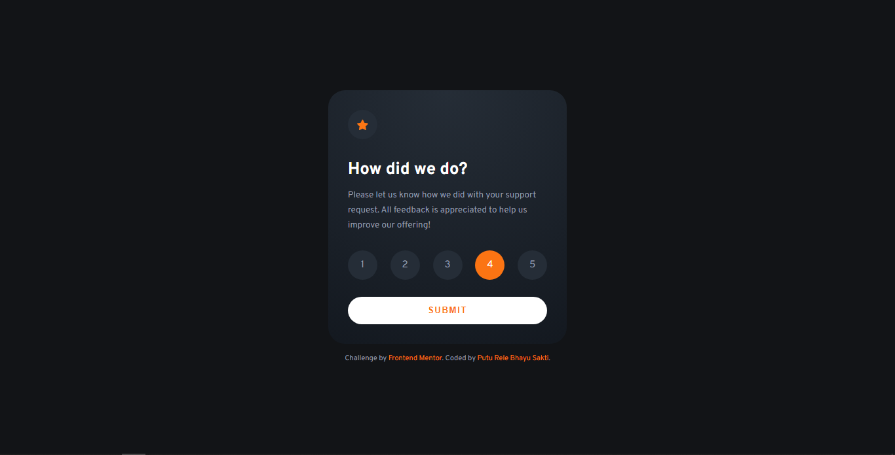
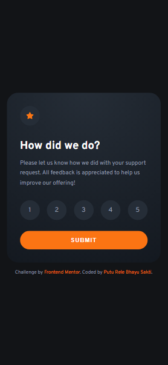
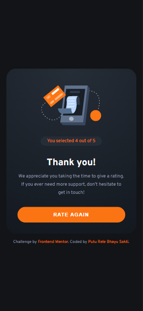

# Frontend Mentor - Interactive rating component solution

This is a solution to the [Interactive rating component challenge on Frontend Mentor](https://www.frontendmentor.io/challenges/interactive-rating-component-koxpeBUmI). Frontend Mentor challenges help you improve your coding skills by building realistic projects.

## Table of contents

- [Overview](#overview)
  - [The challenge](#the-challenge)
  - [Screenshot](#screenshot)
  - [Links](#links)
- [My process](#my-process)
  - [Built with](#built-with)
  - [What I learned](#what-i-learned)
  - [Continued development](#continued-development)
  - [Useful resources](#useful-resources)
- [Author](#author)

## Overview

### The challenge

Users should be able to:

- View the optimal layout for the app depending on their device's screen size
- See hover states for all interactive elements on the page
- Select and submit a number rating
- See the "Thank you" card state after submitting a rating

### Screenshot

### Links

- Solution URL: [Solution URL here](https://your-solution-url.com)
- Live Site URL: [Live site URL here](https://lere22.github.io/interactive-rating-component-chall/)

## My process

### Built with

- Semantic HTML5 markup
- CSS custom properties
- Flexbox
- Pure Javascript

### What I learned

What i learned from creating the project Interactive rating component is how to integrated not just web but with the mobile view and learned how to creating design and responsive design with css from scratch.

Also still I use basic javascript with some inspiration from other people [solutions](https://www.frontendmentor.io/solutions). So I'm still try to learn about the code structure and stuff.

### Continued development

I want to continue this project to collaborate with my other projects in the future.

### Useful resources

- [Fonts](https://fonts.google.com/specimen/Outfit) - This helped me for choosing the font what i want.
- [Frontend Mentor Resource](https://www.frontendmentor.io/resources) - This is an amazing resource which helped me to working on frontend project.
- [CSS Gradient](https://cssgradient.io/) - This is an amazing tool to create gradient color for designing an app.
- [W3 Schools](https://www.w3schools.com/) - This helped me for understanding the syntax of some programming language.

## Author

- Code by - Putu Rele Bhayu Sakti
- Frontend Mentor - [@lere22](https://www.frontendmentor.io/profile/lere22)
